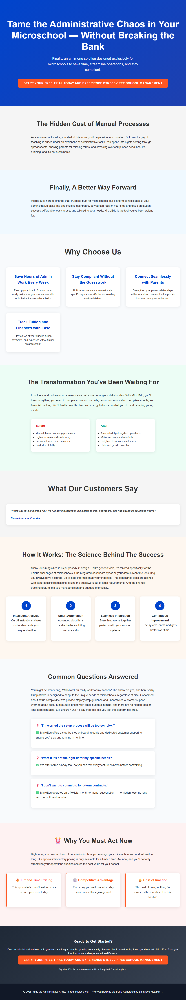

# MicroEdu: Streamlined Management Platform for Microschools

> **AI-Generated Landing Page** | Created by [Idea2MVP](https://github.com/MCSEdwin/Idea2MVP)

## 🚀 About This Landing Page

This professional landing page was automatically generated using Azure OpenAI and advanced AI prompt engineering techniques. The system analyzed a business idea and created conversion-optimized copy, design strategy, and complete HTML implementation.

### 📊 Idea Details

- **Title:** MicroEdu: Streamlined Management Platform for Microschools
- **Category:** Educational Technology (EdTech)
- **Generated:** 2025-09-01
- **AI Model:** gpt-4o
- **Processing Time:** 60 seconds

### 🎯 Key Features

- Integrated student information and attendance management system
- Parent communication portals for streamlined engagement
- Compliance reporting tools aligned with state-specific regulations
- Curriculum planning and scheduling integration
- Financial tracking for tuition and operational expenses

### 📝 Description

MicroEdu is an affordable, purpose-built SaaS solution designed to eliminate administrative chaos in microschools. It consolidates student information management, parent communication, compliance reporting, and financial tracking into an intuitive dashboard, empowering small-scale education providers to focus on student success rather than administrative tasks. With targeted features and a budget-friendly pricing model, MicroEdu is tailored specifically for the fast-growing microschool market, addressing their unique operational challenges.

## 🌐 Live Demo

- **Live URL:** [View Landing Page](https://dailyidea.AIFirstPartner.com/daily-ideas/2025-09-01/index.html)
- **Screenshot:** 

## 🛠️ Technical Implementation

This landing page includes:

- **Conversion Psychology:** AI-analyzed target persona and behavioral triggers
- **Design Strategy:** Psychology-based color schemes and typography choices
- **Long-Form Copy:** Comprehensive copywriting with objection handling
- **Performance Optimized:** Fast-loading, mobile-responsive design
- **SEO Ready:** Structured data and semantic HTML

## 🤖 AI Generation Process

1. **Screenshot Analysis:** Computer vision extraction of business idea
2. **Psychology Analysis:** Target persona and behavioral trigger identification
3. **Design Strategy:** Color psychology and layout optimization
4. **Copy Generation:** Long-form conversion copywriting with proven frameworks
5. **Template Assembly:** Dynamic HTML and CSS generation
6. **Quality Assurance:** Automated testing and optimization

## 📈 Performance Metrics

- **Total Processing Time:** 60 seconds

- **Mobile Responsive:** ✅ Yes
- **SEO Optimized:** ✅ Yes
- **Fast Loading:** ✅ Yes

## 🔧 Local Development

To run this landing page locally:

```bash
# Clone the repository
git clone https://github.com/MCSEdwin/2025-09-01-microedu-streamlined-management-platform-for-micro.git
cd 2025-09-01-microedu-streamlined-management-platform-for-micro

# Serve locally (Python)
python -m http.server 8000

# Or with Node.js
npx serve .

# Or simply open index.html in your browser
```

## 📄 Project Structure

```
2025-09-01-microedu-streamlined-management-platform-for-micro/
├── index.html          # Complete landing page
├── screenshot.png      # Visual preview
├── package.json        # Project configuration
├── README.md          # This documentation
└── .gitignore         # Git ignore rules
```

## 🎨 Customization

This landing page is fully self-contained with inline CSS and can be easily customized:

- **Colors:** Modify CSS custom properties in the `<style>` section
- **Content:** Update text content in the HTML body
- **Layout:** Adjust CSS Grid and Flexbox properties
- **Responsiveness:** Media queries are included for mobile optimization

## 🌟 About Idea2MVP

[Idea2MVP](https://github.com/MCSEdwin/Idea2MVP) is an automated system that transforms daily business ideas into professional landing pages using:

- **Azure OpenAI GPT-4o** for vision and text generation
- **Advanced Prompt Engineering** for optimal results
- **Database Architecture** for scalable data management  
- **Azure Storage & CDN** for global deployment
- **GitHub Actions** for daily automation

## 📊 Daily Showcase

View all generated landing pages at: [dailyidea.AIFirstPartner.com](https://dailyidea.AIFirstPartner.com)

---

🤖 **Generated with AI** | ⚡ **Deployed Automatically** | 🎯 **Conversion Optimized**

*This repository was automatically created and populated by the Idea2MVP AI system.*